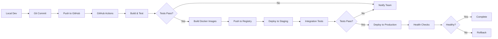

# Production Deployment Guide - DoganConsult Platform
**Last Updated**: December 18, 2025

## 📋 What Needs to Be Released to Production

### 1. New Files Created (PlatformLayout System)
```
✅ PlatformLayout.razor (130 lines)
   Location: aspnet-core/src/DoganConsult.Web.Blazor/Components/Layout/
   Purpose: Shared layout with global header, LanguageSwitcher, breadcrumbs

✅ PlatformLayout.razor.css (280 lines)
   Location: aspnet-core/src/DoganConsult.Web.Blazor/Components/Layout/
   Purpose: Scoped styling with purple gradient, RTL support, glass-morphism
```

### 2. Modified Files
```
✅ _Imports.razor
   Change: Added @using DoganConsult.Web.Blazor.Components.Layout

✅ Organizations.razor
   Change: Added @layout PlatformLayout

✅ Workspaces.razor
   Change: Added @layout PlatformLayout

✅ Documents.razor
   Change: Added @layout PlatformLayout

✅ UserProfiles.razor
   Change: Added @layout PlatformLayout

✅ AIChat.razor
   Change: Added @layout PlatformLayout

✅ AuditLogs.razor
   Change: Added @layout PlatformLayout

✅ Approvals.razor
   Change: Added @layout PlatformLayout
```

### 3. What NOT to Push to Production
```
❌ PLATFORM_LAYOUT_IMPLEMENTATION.md (documentation only)
❌ .vs/ directory
❌ bin/ and obj/ directories
❌ **/Logs/ directories
❌ appsettings.Development.json (keep local)
❌ launchSettings.json (development only)
```

---

## 🚀 Production Deployment Checklist

### Phase 1: Pre-Deployment Preparation

#### A. Configuration Changes for Production

**1. Update Connection Strings** (Each service's `appsettings.Production.json`):
```json
{
  "ConnectionStrings": {
    "Default": "Server=your-prod-postgresql.railway.app;Port=5432;Database=DoganConsult_Identity;User Id=postgres;Password=YOUR_PROD_PASSWORD;Ssl Mode=Require;"
  }
}
```

**2. Update Redis Configuration**:
```json
{
  "Redis": {
    "Configuration": "your-prod-redis.railway.app:6379,password=YOUR_REDIS_PASSWORD,ssl=True"
  }
}
```

**3. Update Service URLs** (in Web.Blazor and Gateway):
```json
{
  "RemoteServices": {
    "Default": {
      "BaseUrl": "https://api.doganconsult.com/"
    }
  }
}
```

**4. Disable Auto-Login** (Web.Blazor's WebBlazorModule.cs):
```csharp
// COMMENT OUT OR REMOVE in production:
// Configure<AbpAccountOptions>(options =>
// {
//     options.TenantAdminUserName = "admin";
//     options.TenantAdminPassword = "1q2w3E*";
// });
```

**5. Set Environment Variables**:
```bash
ASPNETCORE_ENVIRONMENT=Production
ASPNETCORE_URLS=https://+:443;http://+:80
```

#### B. Security Hardening

**1. Update CORS Policies** (Each HttpApi.Host):
```csharp
context.Services.AddCors(options =>
{
    options.AddDefaultPolicy(builder =>
    {
        builder
            .WithOrigins("https://doganconsult.com", "https://www.doganconsult.com")
            .WithAbpExposedHeaders()
            .SetIsOriginAllowedToAllowWildcardSubdomains()
            .AllowAnyHeader()
            .AllowAnyMethod()
            .AllowCredentials();
    });
});
```

**2. Enable HTTPS Redirection** (Startup/Program.cs):
```csharp
app.UseHttpsRedirection();
app.UseHsts();
```

**3. Update OpenIddict Configuration** (Identity service):
```csharp
.AddServer(options =>
{
    options.SetIssuer(new Uri("https://identity.doganconsult.com"));
    // ... rest of configuration
})
```

#### C. Performance Optimization

**1. Enable Response Compression**:
```csharp
services.AddResponseCompression(options =>
{
    options.EnableForHttps = true;
    options.Providers.Add<BrotliCompressionProvider>();
    options.Providers.Add<GzipCompressionProvider>();
});
```

**2. Configure Caching Headers**:
```csharp
services.AddResponseCaching();
app.UseResponseCaching();
```

**3. Bundle and Minify Assets** (Already configured via ABP):
```csharp
Configure<AbpBundlingOptions>(options =>
{
    options.Mode = BundlingMode.BundleAndMinify; // Production default
});
```

---

### Phase 2: Build for Production

**1. Clean Previous Builds**:
```powershell
cd d:\test\aspnet-core
dotnet clean DoganConsult.Platform.sln
Remove-Item -Recurse -Force **/bin, **/obj
```

**2. Build in Release Mode**:
```powershell
dotnet build DoganConsult.Platform.sln -c Release
```

**3. Publish Each Service**:
```powershell
# Identity Service
dotnet publish src/DoganConsult.Identity.HttpApi.Host/DoganConsult.Identity.HttpApi.Host.csproj -c Release -o publish/Identity

# Organization Service
dotnet publish src/DoganConsult.Organization.HttpApi.Host/DoganConsult.Organization.HttpApi.Host.csproj -c Release -o publish/Organization

# AI Service
dotnet publish src/DoganConsult.AI.HttpApi.Host/DoganConsult.AI.HttpApi.Host.csproj -c Release -o publish/AI

# Workspace Service
dotnet publish src/DoganConsult.Workspace.HttpApi.Host/DoganConsult.Workspace.HttpApi.Host.csproj -c Release -o publish/Workspace

# UserProfile Service
dotnet publish src/DoganConsult.UserProfile.HttpApi.Host/DoganConsult.UserProfile.HttpApi.Host.csproj -c Release -o publish/UserProfile

# Audit Service
dotnet publish src/DoganConsult.Audit.HttpApi.Host/DoganConsult.Audit.HttpApi.Host.csproj -c Release -o publish/Audit

# Document Service
dotnet publish src/DoganConsult.Document.HttpApi.Host/DoganConsult.Document.HttpApi.Host.csproj -c Release -o publish/Document

# Gateway
dotnet publish src/gateway/DoganConsult.Gateway/DoganConsult.Gateway.csproj -c Release -o publish/Gateway

# Web Blazor UI
dotnet publish src/DoganConsult.Web.Blazor/DoganConsult.Web.Blazor.csproj -c Release -o publish/Blazor
```

---

### Phase 3: Database Migration for Production

**1. Generate Migration Scripts** (for each service):
```powershell
# Identity Service
cd src/DoganConsult.Identity.HttpApi.Host
dotnet ef migrations script -o ../../../publish/migrations/Identity.sql

# Repeat for each service...
```

**2. Run DbMigrator in Production**:
```powershell
cd src/DoganConsult.DbMigrator
dotnet run --project DoganConsult.DbMigrator.csproj --configuration Release
```

---

### Phase 4: Deployment Methods

#### Option A: Docker Deployment (Recommended)

**1. Create Production Docker Compose**:
```yaml
# docker-compose.prod.yml
version: '3.8'

services:
  identity:
    image: doganconsult/identity:latest
    environment:
      - ASPNETCORE_ENVIRONMENT=Production
      - ASPNETCORE_URLS=https://+:443;http://+:80
    ports:
      - "44346:443"
    volumes:
      - ./certs:/https:ro
    depends_on:
      - postgres
      - redis

  organization:
    image: doganconsult/organization:latest
    environment:
      - ASPNETCORE_ENVIRONMENT=Production
    ports:
      - "44337:443"
    depends_on:
      - identity

  # ... repeat for all services

  gateway:
    image: doganconsult/gateway:latest
    environment:
      - ASPNETCORE_ENVIRONMENT=Production
    ports:
      - "443:443"
      - "80:80"
    depends_on:
      - identity
      - organization
      - workspace
      - document
      - userprofile
      - ai
      - audit

  blazor:
    image: doganconsult/blazor:latest
    environment:
      - ASPNETCORE_ENVIRONMENT=Production
    ports:
      - "44373:443"
    depends_on:
      - gateway
```

**2. Build Docker Images**:
```powershell
# Build all images
docker build -t doganconsult/identity:latest -f src/DoganConsult.Identity.HttpApi.Host/Dockerfile .
docker build -t doganconsult/organization:latest -f src/DoganConsult.Organization.HttpApi.Host/Dockerfile .
# ... repeat for all services
```

**3. Deploy to Production**:
```powershell
docker-compose -f docker-compose.prod.yml up -d
```

#### Option B: Hetzner/Railway/Azure Deployment

**1. Create Deployment Script** (deploy-production.ps1):
```powershell
# Upload published files to server
scp -r publish/* user@your-server:/var/www/doganconsult/

# SSH into server and restart services
ssh user@your-server << 'EOF'
  sudo systemctl restart doganconsult-identity
  sudo systemctl restart doganconsult-organization
  sudo systemctl restart doganconsult-ai
  sudo systemctl restart doganconsult-workspace
  sudo systemctl restart doganconsult-userprofile
  sudo systemctl restart doganconsult-audit
  sudo systemctl restart doganconsult-document
  sudo systemctl restart doganconsult-gateway
  sudo systemctl restart doganconsult-blazor
EOF
```

**2. Systemd Service Files** (Example for Identity):
```ini
# /etc/systemd/system/doganconsult-identity.service
[Unit]
Description=DoganConsult Identity Service
After=network.target

[Service]
Type=notify
WorkingDirectory=/var/www/doganconsult/Identity
ExecStart=/usr/bin/dotnet DoganConsult.Identity.HttpApi.Host.dll
Restart=always
RestartSec=10
KillSignal=SIGINT
SyslogIdentifier=doganconsult-identity
User=www-data
Environment=ASPNETCORE_ENVIRONMENT=Production
Environment=DOTNET_PRINT_TELEMETRY_MESSAGE=false

[Install]
WantedBy=multi-user.target
```

---

## 🔧 How to Add More Modules to PlatformLayout

### Step-by-Step Guide to Extend the System

#### 1. Create a New Page (Example: "Reports.razor")

```razor
@page "/reports"
@layout PlatformLayout
@using DoganConsult.Web.Blazor.Services

<PageTitle>Reports</PageTitle>

<Card>
    <CardHeader>
        <h3>📊 Reports Dashboard</h3>
    </CardHeader>
    <CardBody>
        <p>Your report content here...</p>
    </CardBody>
</Card>

@code {
    protected override async Task OnInitializedAsync()
    {
        // Your initialization logic
    }
}
```

#### 2. Add Menu Item (WebBlazorMenuContributor.cs)

```csharp
private Task ConfigureMainMenuAsync(MenuConfigurationContext context)
{
    // ... existing menu items
    
    context.Menu.AddItem(new ApplicationMenuItem(
        "Reports",
        L["Menu:Reports"],
        "/reports",
        icon: "fas fa-chart-bar",
        order: 8
    ));
    
    return Task.CompletedTask;
}
```

#### 3. Update PlatformLayout Breadcrumbs (Optional)

If you want custom breadcrumb text:

```razor
@code {
    private void ParseCurrentPage()
    {
        var path = NavigationManager.ToBaseRelativePath(NavigationManager.Uri);
        
        // Add your new page
        if (path.StartsWith("reports"))
        {
            CurrentPageTitle = L["Menu:Reports"];
            CurrentPageIcon = "fas fa-chart-bar";
        }
    }
}
```

#### 4. Add Localization Keys (en.json and ar.json)

**en.json**:
```json
{
  "Menu:Reports": "Reports",
  "Reports:Title": "Reports Dashboard"
}
```

**ar.json**:
```json
{
  "Menu:Reports": "التقارير",
  "Reports:Title": "لوحة التقارير"
}
```

#### 5. Add Service Integration (if needed)

```csharp
// Services/ReportService.cs
public class ReportService : ITransientDependency
{
    private readonly HttpClient _httpClient;
    
    public ReportService(HttpClient httpClient)
    {
        _httpClient = httpClient;
    }
    
    public async Task<List<ReportDto>> GetReportsAsync()
    {
        return await _httpClient.GetFromJsonAsync<List<ReportDto>>(
            "https://localhost:44375/api/reports"
        );
    }
}
```

#### 6. Test Your New Page

```
✅ Navigate to: https://localhost:44373/reports
✅ Verify: Global header with LanguageSwitcher appears
✅ Verify: Breadcrumb shows "Home > Reports"
✅ Verify: Switch to Arabic - RTL layout applies
✅ Verify: Responsive on mobile
```

---

## 📦 Production File Structure (What to Push)

```
DoganConsult.Platform/
├── aspnet-core/
│   ├── src/
│   │   ├── DoganConsult.Web.Blazor/
│   │   │   ├── Components/
│   │   │   │   └── Layout/
│   │   │   │       ├── PlatformLayout.razor ✅ PUSH
│   │   │   │       └── PlatformLayout.razor.css ✅ PUSH
│   │   │   ├── Pages/
│   │   │   │   ├── Organizations.razor ✅ PUSH
│   │   │   │   ├── Workspaces.razor ✅ PUSH
│   │   │   │   ├── Documents.razor ✅ PUSH
│   │   │   │   ├── UserProfiles.razor ✅ PUSH
│   │   │   │   ├── AIChat.razor ✅ PUSH
│   │   │   │   ├── AuditLogs.razor ✅ PUSH
│   │   │   │   └── Approvals.razor ✅ PUSH
│   │   │   └── _Imports.razor ✅ PUSH
│   │   ├── DoganConsult.Identity.HttpApi.Host/ ✅ PUSH
│   │   ├── DoganConsult.Organization.HttpApi.Host/ ✅ PUSH
│   │   ├── DoganConsult.AI.HttpApi.Host/ ✅ PUSH
│   │   ├── DoganConsult.Workspace.HttpApi.Host/ ✅ PUSH
│   │   ├── DoganConsult.UserProfile.HttpApi.Host/ ✅ PUSH
│   │   ├── DoganConsult.Audit.HttpApi.Host/ ✅ PUSH
│   │   ├── DoganConsult.Document.HttpApi.Host/ ✅ PUSH
│   │   └── gateway/
│   │       └── DoganConsult.Gateway/ ✅ PUSH
│   ├── common.props ✅ PUSH
│   ├── NuGet.Config ✅ PUSH
│   └── DoganConsult.Platform.sln ✅ PUSH
└── README.md ✅ PUSH
```

---

## 🔄 Production Workflow

### Continuous Deployment Pipeline



### GitHub Actions Workflow (.github/workflows/production-deploy.yml)

```yaml
name: Production Deployment

on:
  push:
    branches: [ main ]
    paths:
      - 'aspnet-core/src/**'
      - '!**/*.md'

jobs:
  build-and-deploy:
    runs-on: ubuntu-latest
    
    steps:
    - uses: actions/checkout@v3
    
    - name: Setup .NET 10
      uses: actions/setup-dotnet@v3
      with:
        dotnet-version: '10.0.x'
    
    - name: Restore dependencies
      run: dotnet restore aspnet-core/DoganConsult.Platform.sln
    
    - name: Build
      run: dotnet build aspnet-core/DoganConsult.Platform.sln -c Release --no-restore
    
    - name: Test
      run: dotnet test aspnet-core/DoganConsult.Platform.sln -c Release --no-build
    
    - name: Publish Services
      run: |
        dotnet publish aspnet-core/src/DoganConsult.Identity.HttpApi.Host -c Release -o publish/Identity
        dotnet publish aspnet-core/src/DoganConsult.Organization.HttpApi.Host -c Release -o publish/Organization
        dotnet publish aspnet-core/src/DoganConsult.AI.HttpApi.Host -c Release -o publish/AI
        dotnet publish aspnet-core/src/DoganConsult.Workspace.HttpApi.Host -c Release -o publish/Workspace
        dotnet publish aspnet-core/src/DoganConsult.UserProfile.HttpApi.Host -c Release -o publish/UserProfile
        dotnet publish aspnet-core/src/DoganConsult.Audit.HttpApi.Host -c Release -o publish/Audit
        dotnet publish aspnet-core/src/DoganConsult.Document.HttpApi.Host -c Release -o publish/Document
        dotnet publish aspnet-core/src/gateway/DoganConsult.Gateway -c Release -o publish/Gateway
        dotnet publish aspnet-core/src/DoganConsult.Web.Blazor -c Release -o publish/Blazor
    
    - name: Deploy to Production
      run: |
        # Your deployment commands here
        scp -r publish/* ${{ secrets.PROD_SERVER_USER }}@${{ secrets.PROD_SERVER_HOST }}:/var/www/doganconsult/
        ssh ${{ secrets.PROD_SERVER_USER }}@${{ secrets.PROD_SERVER_HOST }} 'sudo systemctl restart doganconsult-*'
```

---

## 🛡️ Production Monitoring

### Health Checks Configuration

Add to each service's `Program.cs`:

```csharp
builder.Services.AddHealthChecks()
    .AddNpgSql(configuration.GetConnectionString("Default"))
    .AddRedis(configuration["Redis:Configuration"])
    .AddCheck<ApplicationHealthCheck>("application");

app.MapHealthChecks("/health", new HealthCheckOptions
{
    ResponseWriter = UIResponseWriter.WriteHealthCheckUIResponse
});
```

### Logging Configuration (Serilog)

```json
{
  "Serilog": {
    "MinimumLevel": {
      "Default": "Information",
      "Override": {
        "Microsoft": "Warning",
        "System": "Warning"
      }
    },
    "WriteTo": [
      {
        "Name": "Console"
      },
      {
        "Name": "File",
        "Args": {
          "path": "/var/log/doganconsult/identity-.log",
          "rollingInterval": "Day",
          "retainedFileCountLimit": 30
        }
      },
      {
        "Name": "Seq",
        "Args": {
          "serverUrl": "http://seq.doganconsult.com:5341"
        }
      }
    ]
  }
}
```

---

## ✅ Pre-Production Verification Checklist

### Security
- [ ] All secrets moved to environment variables or Azure Key Vault
- [ ] HTTPS enforced on all endpoints
- [ ] CORS configured for production domains only
- [ ] Auto-login disabled
- [ ] Strong passwords enforced
- [ ] Rate limiting enabled
- [ ] SQL injection protection verified
- [ ] XSS protection enabled
- [ ] CSRF tokens configured

### Performance
- [ ] Response compression enabled
- [ ] Caching configured
- [ ] Database indexes optimized
- [ ] Connection pooling configured
- [ ] CDN configured for static assets
- [ ] Lazy loading enabled
- [ ] Bundle size optimized

### Reliability
- [ ] Health checks configured
- [ ] Retry policies implemented
- [ ] Circuit breakers configured
- [ ] Database backup scheduled
- [ ] Logging configured (Serilog)
- [ ] Application Insights configured
- [ ] Error tracking setup (Raygun/Sentry)

### Functionality
- [ ] All 9 services start successfully
- [ ] PlatformLayout appears on all 7 pages
- [ ] LanguageSwitcher works (English ↔ Arabic)
- [ ] RTL layout applies correctly
- [ ] Breadcrumbs update per page
- [ ] Authentication flow works
- [ ] API calls succeed
- [ ] Database migrations applied

---

## 🚀 Quick Production Deployment Commands

```powershell
# 1. Build everything
cd d:\test\aspnet-core
dotnet build DoganConsult.Platform.sln -c Release

# 2. Publish all services
.\publish-all.ps1

# 3. Deploy to production
.\deploy-production.ps1

# 4. Verify deployment
.\verify-production.ps1

# 5. Monitor logs
ssh user@prod-server
journalctl -u doganconsult-* -f
```

---

## 📊 Post-Deployment Verification

### Service Health Checks
```bash
curl https://identity.doganconsult.com/health
curl https://organization.doganconsult.com/health
curl https://ai.doganconsult.com/health
curl https://workspace.doganconsult.com/health
curl https://userprofile.doganconsult.com/health
curl https://audit.doganconsult.com/health
curl https://document.doganconsult.com/health
curl https://api.doganconsult.com/health
curl https://doganconsult.com/health
```

### UI Verification
1. Visit https://doganconsult.com
2. Login with production credentials
3. Navigate to each page:
   - /organizations
   - /workspaces
   - /documents
   - /userprofiles
   - /ai-chat
   - /audit-logs
   - /approvals
4. Verify global header appears on all pages
5. Test LanguageSwitcher (English ↔ Arabic)
6. Verify RTL layout activates correctly
7. Test on mobile devices

---

## 🆘 Rollback Procedure

If something goes wrong:

```powershell
# 1. Stop current services
ssh user@prod-server 'sudo systemctl stop doganconsult-*'

# 2. Restore previous version
ssh user@prod-server 'cp -r /var/www/doganconsult-backup/* /var/www/doganconsult/'

# 3. Restart services
ssh user@prod-server 'sudo systemctl start doganconsult-*'

# 4. Verify health
.\verify-production.ps1
```

---

## 📝 Production Support

### Monitoring URLs
- Application: https://doganconsult.com
- Health Dashboard: https://health.doganconsult.com
- Logs (Seq): https://logs.doganconsult.com
- Metrics (Grafana): https://metrics.doganconsult.com

### Emergency Contacts
- DevOps Lead: [Your contact]
- Database Admin: [Your contact]
- Security Team: [Your contact]

---

**End of Production Deployment Guide**
